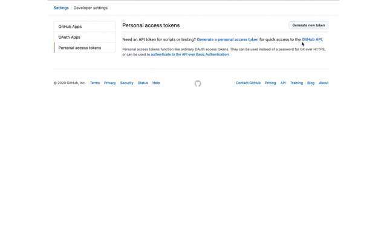

# TL;DR

Use the script [reporting.ts](../scripts/reporting.ts) to generate a report of the current PIA & STRA status of a the repositories in the `bcgov` organization. This script uses the `COMPLIANCE.yaml` file, if it exists, in each repository.

# Introduction

All repositories are asked, by the repomountie, to contain a file called `COMPLIANCE.yaml` in the root path. This file contains the compliance status for both a Privacy Information Assessment (PIA) and Security Threat and Risk Assessment (STRA). They are also asked, again by the bot, to add a Organizational Code (eg. CITZ) as a [topic](https://github.blog/2017-01-31-introducing-topics/) to the repo.

The reporting script [reporting.ts](../scripts/reporting.ts) will use both the topic and compliance report to create a report in Comma Separated Value (CSV) format.

# Usage

Before you can run this script you need to create a [Personal API Token](https://github.blog/2013-05-16-personal-api-tokens/) the script can use to access the GitHub API. Follow GitHubs documentation on how to do this.



☠️ Yes, this token was revoked before I published this doc. ☠️

Once you have your token, export it as an environment variable; the script will look for and use it. If not found it will complain.

```console
export GITHUB_TOKEN=<YOUR_TOKEN_HERE>
```

🤓 ProTip

If you are on Mac, use `pbpaste` so the token is not recorded by your shell history. The command will look like: `export GITHUB_TOKEN=$(pbpaste)`

Next, install the project packages, they will be needed for the script to run. If you're just checking the script out and don't plan to run it frequently delete the `node_modules` directory when you are done.

```console
npm i
```

You're ready to go! Use `npm` to run the reporting script; it takes several minutes to run through the several hundred repos currently in the `bcgov` organization.

```console
npm run report
```

You'll notice it creates a `report` directory with the final output.
